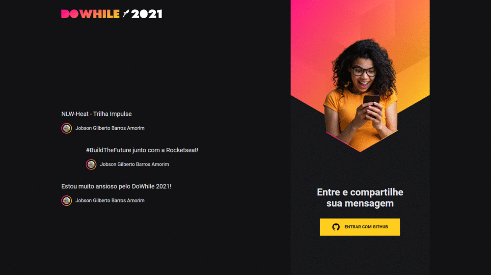

# :rocket::seat: NLW-Heat - Impulse Track - React Frontend :globe_with_meridians:

[NLW-Heat](https://nextlevelweek.com/inscricao/7) frontend project with React, Github OAuth, JWT and CSS Modules

## :hammer: Status

> :white_check_mark: Finished :lock:

## :bookmark: Content Table
<!--ts-->
  * [App Interface](#newspaper-app-interface)
  * [Technologies](#books-technologies)
  * [Install and Run](#calling-installing-and-running-this-project)
  * [Author and License](#memo-author-and-license)
<!--te-->

## :newspaper: App Interface
### :computer: Planned Design

<p align="center"></p>

Based on [Rocketseat's NLW-Heat design](https://www.figma.com/community/file/1031699316177416916). You might need a [Figma](https://figma.com) account to access the design.

### :tada: Final Result

<p align="center"></p>

## :books: Technologies

- [NodeJS](https://nodejs.org/en/)
- [Yarn](https://yarnpkg.com/)
- [Vite](https://vitejs.dev/)
- [React](https://reactjs.org/)
- [Typescript](https://www.typescriptlang.org/)
- [CSS Modules](https://github.com/css-modules/css-modules)
- [SASS](https://sass-lang.com/)
- [Github OAuth](https://docs.github.com/en/developers/apps/building-oauth-apps/authorizing-oauth-apps)
- [JWT](https://www.npmjs.com/package/jsonwebtoken)
- [Axios](https://axios-http.com/)
- [Websockets](https://socket.io/)

## :calling: Installing and running this project

### :wrench: Prerequisites

Before starting, make sure you have [Git](https://git-scm.com/), [Node](https://nodejs.org/en/) and [Yarn](https://yarnpkg.com/) installed.

This project is intended for use alongside the backend server available at https://github.com/jobsonita/rocketseat-nlw-heat-impulse-node. Please, follow the instructions there first and then proceed with the instructions below.

### :inbox_tray: Install and run

Clone the project using Git, install its dependencies through Yarn and run the server:

```bash
git clone https://github.com/jobsonita/rocketseat-nlw-heat-impulse-web.git

# wait for git to finish clonning the project, then navigate to the folder and install the dependencies:

cd rocketseat-nlw-heat-impulse-web

yarn

# Finally, run the server:

yarn dev
```

### :mag: Testing

With the server up, open http://localhost:3000 on one or more browsers, log in through Github OAuth and enjoy sending and receiving messages between them.

## :memo: Author and License

[](https://github.com/jobsonita/jobsonita) | [Jobson Gilberto](https://github.com/jobsonita/jobsonita)
-|-

[](LICENSE)
